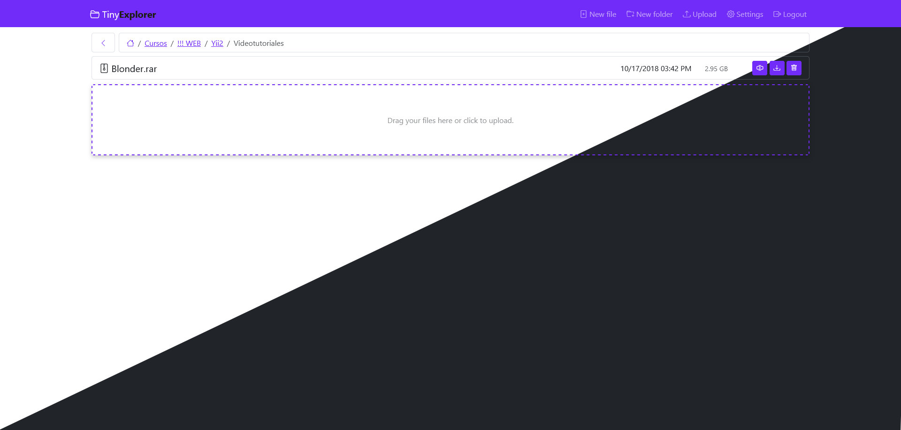
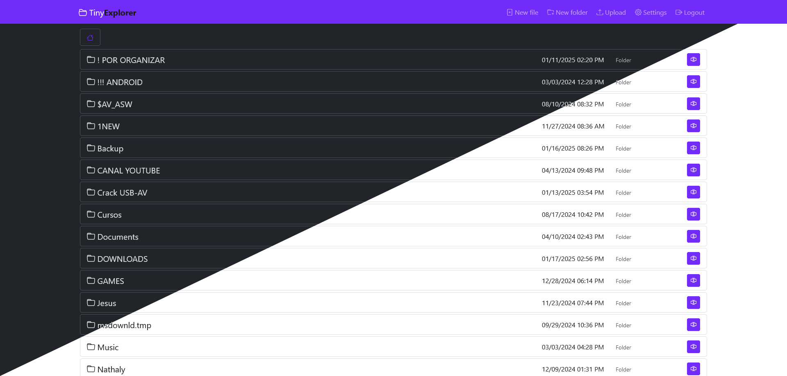

# TinyExplorer v1.2
I developed this system as a personal project to manage my home cloud, allowing me to quickly and easily access all my files from any internet-connected device. Although it was designed for personal use, its flexible structure makes it ideal for extending to business applications, such as a NAS system, offering an efficient solution for centralized data storage and access.

## Requirements
- PHP 8.2.12 or higher.
- Fileinfo, iconv, zip, tar and mbstring extensions are strongly recommended.
- MySQL

## Too much to do
> There are still many things to do, but we continue to develop.

- [x] Translations
- [x] Theme light and dark
- [ ] Register users
- [ ] First installation step
- [ ] View file selected
- [ ] ...others

## Known issues
> When I was testing on Debian using Proxmox and a NAS through Proxmox shared with the container I found permission problems, I could not create, rename or delete files or folders, or upload files to the server using the web system. I have been testing it on Windows and everything works fine. I will continue trying and looking for solutions to make it work correctly on Debian and through the NAS permissions.

## Database

### Table SYSTEM
| Name      | Type         | Null | Extra          |
|-----------|--------------|------|----------------|
| id        | int(11)      | No   | AUTO_INCREMENT |
| theme     | varchar(10)  | No   |                |
| root_path | varchar(255) | No   |                |
| language  | varchar(5)   | No   |                |

### Table USER
| Name        | Type         | Null | Extra          |
|-------------|--------------|------|----------------|
| id          | int(11)      | No   | AUTO_INCREMENT |
| email       | varchar(255) | No   |                |
| password    | varchar(255) | No   |                |
| name        | varchar(200) | Yes  |                |
| auth        | int(11)      | No   | Default(0)     |
| is_active   | tinyint(1)   | No   | Default(0)     |
| is_verified | tinyint      | No   | Default(0)     |
| clef        | varchar(20)  | Yes  |                |

## Images
> Images may be outdated

